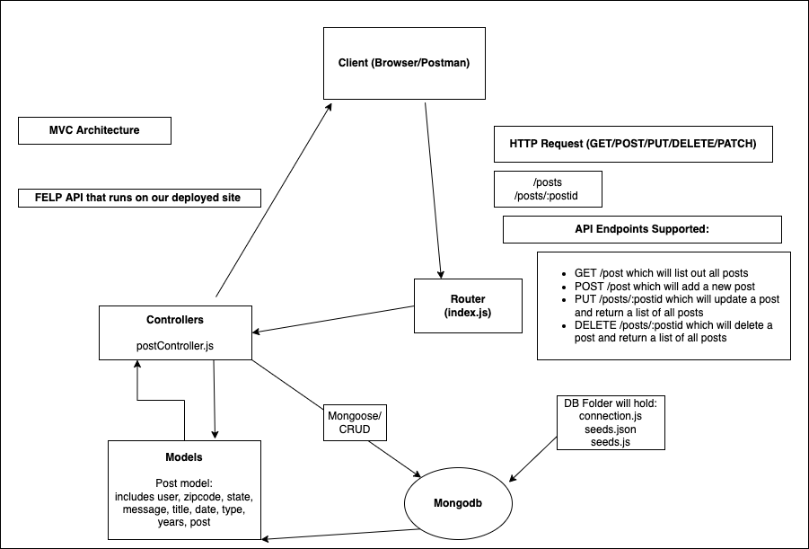

## FELP - Backend

FELP is a place where users can find local spots in their favorite states! Users are able to view recommendations to eat and explore by locals of that state. Ever wanted to go to California? See where users are recommending to go now!

https://felp-official.netlify.app/

This is the backend repo that handles all of the routes for creating, reading, updating, and deleting posts and users!

## API Routes

### Root Route

https://felp-coders.herokuapp.com/api/posts

### Route paths

| Method | Route         | Description             |
| ------ | ------------- | ----------------------- |
| GET    | /             | Read all posts          |
| GET    | /state/:state | Read all posts by state |
| POST   | /             | Create post\*           |
| PUT    | /id/:id       | Update entire post\*    |
| PATCH  | /id/:id       | Update partial post\*   |
| DELETE | /id/:id       | Delete post\*           |

\* Note: User must be logged in to complete routes

## Technologies Used

- Mongodb
- mongoose
- Node.js
- Express.js
- passport
- bcrypt
- cors
- npm
- Postman (local testing)
- Heroku

## Installation

1. fork and clone this repository to your machine
2. cd into the repo
3. run `npm i` or `npm install` to install dependencies
4. open in VScode using `code .`
5. to run your backend locally, run `npx nodemon`

## Contribution Guidelines

### How to identify bugs

> If you identify bugs, submit an issue on the Git repo. Please detail the bug in your issue. If you know how to fix it, feel free to note the methods you would use. You could also submit a pull request with suggested code to fix it.

### Models and Properties

#### Updated Post Model

```
{
	state: String,
	city: String,
	title: String,
	date: String,
	message: String,
	years_of_residence: Number,
	type: String,
	owner: {
		type: mongoose.Schema.Types.ObjectId,
		ref: 'User',
		required: true,
	},
}
```

#### Updated User Model

```
{
		username: {
			type: String,
			required: true,
			unique: true,
		},
		email: {
			type: String,
			required: true,
			unique: true,
		},
		password: {
			type: String,
			required: true,
		},
	},
	{
		timestamps: true,
		toJSON: {
			virtuals: true,
			// ret is the returned Mongoose document
			transform: (_doc, ret) => {
				delete ret.password;
				return ret;
			},
		},
	}
```

### Initial Req. / Res. Cycle Diagram



### Unsolved Problems / Major Hurdles

> Our biggest hurdle was creating the backend with user authorization. Reading through the documents and understanding fully what is happening was challenging, but very rewarding when we figured it out!

### Contributors

- Andrew Kal (https://github.com/AndrewKalGit)
- Frankz Condori (https://github.com/fcondori1)
- Jeremiah Lee (https://github.com/leejoonli)
- Justin Lombardi (https://github.com/thejustinlombardi)
